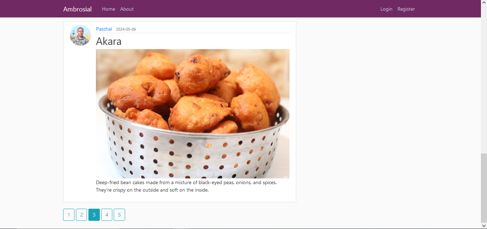
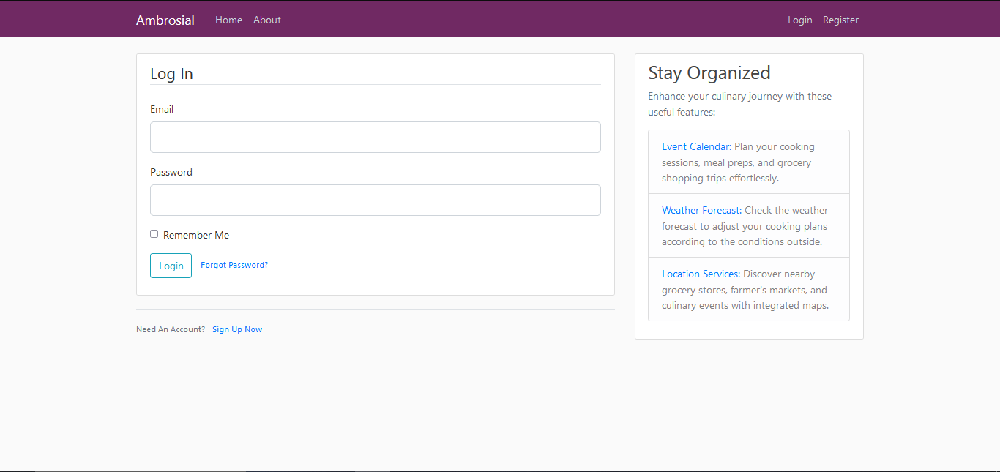
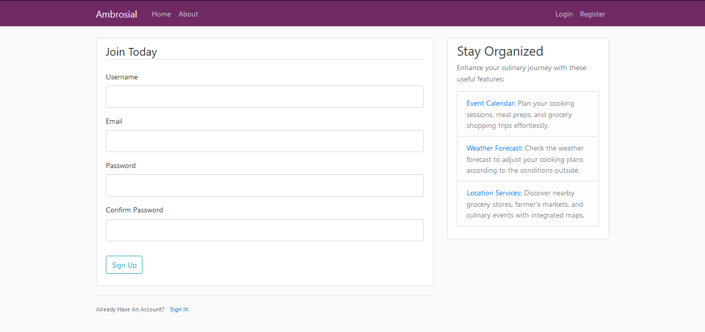

# Ambrosial

## Introduction

Ambrosial is a sophisticated Flask-based web application designed to provide users with a delightful platform for culinary enthusiasts to connect, share, and explore a world of flavors. With a focus on simplicity, functionality, and elegance, Ambrosial offers a seamless experience for users to discover new recipes, share their culinary creations, and engage with like-minded individuals.

**Deployed Site**: [Ambrosial](https://ugwupaschal.pythonanywhere.com/)
**Final Project Blog Article**: [Ambrosial Project - Blog Article](link_to_blog_article)
**Authors**: 
- [Paschal Ugwu - Backend Developer/Project Manager](https://github.com/paschalugwu)
- [Amarachi Nnanta - Frontend Developer](https://github.com/Amastina1)

## Installation

To run Ambrosial locally, follow these steps:

1. Clone the repository: `git clone https://github.com/your_username/ambrosial.git`
2. Navigate to the project directory: `cd ambrosial`
3. Install dependencies: `pip install -r requirements.txt`
4. Set up environment variables (if necessary)
5. Run the application: `python run.py`

## Usage

Once the application is running, you can access it via the provided URL. Here are some key features:

- **User Registration and Authentication**: Sign up for an account and log in securely to access the platform's features.
- **Post Creation and Sharing**: Create captivating posts about your favorite recipes, cooking techniques, and culinary experiences, and share them with the community.
- **Profile Management**: Customize your profile with a personalized avatar and manage your account settings with ease.
- **Password Reset Functionality**: Easily reset your password in case you forget it, ensuring uninterrupted access to your account.
- **Pagination**: Effortlessly navigate through a vast collection of posts with the newly implemented pagination feature, enhancing your browsing experience.

## Contributing

Contributions to Ambrosial are welcome! Here's how you can contribute:
- Fork the repository
- Create a new branch (`git checkout -b feature`)
- Make your changes and commit them (`git commit -am 'Add new feature'`)
- Push your changes to the branch (`git push origin feature`)
- Create a pull request

## Related Projects

- [Recipe App](https://github.com/paschalugwu/Ambrosial): A companion mobile app for accessing recipes on the go.

## Licensing

This project is licensed under the terms of the MIT license.

## Screenshots

### Home Page

### Login Page

### Registration Page

### Account Page

